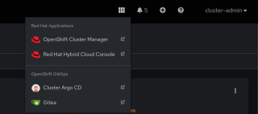

## CI/CD Demo with Tekton Pipelines

This repo is CI/CD demo using [Tekton](http://www.tekton.dev) pipelines on OpenShift which builds and deploys the [Spring PetClinic](https://github.com/spring-projects/spring-petclinic) sample Spring Boot application. This demo creates:
* 3 namespaces for CI/CD, DEV and STAGE projects
* 2 Tekton pipelines for deploying application to DEV and promoting to STAGE environments
* gitea git server (username/password: `demo-user`/`gitea123`)
* Sonatype Nexus (username/password: `admin`/`admin123`)
* SonarQube (username/password: `admin`/`admin`)
* Report repository for test and project generated reports
* Imports [Spring PetClinic](https://github.com/spring-projects/spring-petclinic) repository into Gitea git server
* Adds a webhook to `spring-petclinic` repository in gitea to start the Tekton pipeline

<p align="center">
  
</p>


## Deploy

1. Get an OpenShift cluster via https://try.openshift.com
1. Install OpenShift Pipelines Operator
1. Download [OpenShift CLI](https://mirror.openshift.com/pub/openshift-v4/clients/ocp/latest/) and [Tekton CLI](https://github.com/tektoncd/cli/releases)
1. Deploy the demo

    ```
    $ oc apply -k https://github.com/nreilly-rhn/tekton-demo/ArgoCD/Init

    $ until oc wait argocds.argoproj.io -n openshift-gitops openshift-gitops --for jsonpath='{.status.phase}'=Available; do sleep 10; done

    $ oc apply -k https://github.com/nreilly-rhn/tekton-demo/ArgoCD/config/apps

    ```

1. Start the deploy pipeline by making a change in the `spring-petclinic` Git repository on Gitea.

1. Check pipeline run logs

    ```
    $ tkn pipeline logs petclinic-deploy-dev -n cicd
    ```


## Deploy DEV Pipeline

On every push to the `spring-petclinic` git repository on Gitea git server, the following steps are executed within the DEV pipeline:

1. Code is cloned from Gitea git server and the unit-tests are run
1. Unit tests are executed and in parallel the code is analyzed by SonarQube for anti-patterns, and a dependency report is generated
1. Application is packaged as a JAR and released to Sonatype Nexus snapshot repository
1. A container image is built in DEV environment using S2I, and pushed to OpenShift internal registry, and tagged with `spring-petclinic:[branch]-[commit-sha]` and `spring-petclinic:latest`
1. Kubernetes manifests and performance tests configurations are cloned from Git repository
1. Application is deployed into the DEV environment using `kustomize`, the DEV manifests from Git, and the application `[branch]-[commit-sha]` image tag built in previous steps
1. Integrations tests and Gatling performance tests are executed in parallel against the DEV environment and the results are uploaded to the report server


## Deploy STAGE Pipeline

The STAGE deploy pipeline requires the image tag that you want to deploy into STAGE environment. The following steps take place within the STAGE pipeline:
1. Kubernetes manifests are cloned from Git repository
1. Application is deployed into the STAGE environment using `kustomize`, the STAGE manifests from Git, and the application `[branch]-[commit-sha]` image tag built in previous steps. Alternatively you can deploy the `latest` tag of the application image for demo purposes.
1. In parallel, tests are cloned from Git repository
1. Tests are executed against the staging environment


## Demonstrate appication fix

### Fix image
1. Open the Gitea repository for the spring-petclinic application
> There is a consoleLink created by the demo:



1. Edit the welcome.html and error.html pages to fix the image orientation, edit "upets.png" to pets.png


> spring-petclinic/src/main/resources/templates/welcome.html
>
> spring-petclinic/src/main/resources/templates/error.html

1. wait for the pipeline to complete and check that the image is now oriented correctly

### Fic Logo
1. Edit the CSS template 
> src/main/resources/templates/fragments/layout.html
1. Update line 83, change "spring-logo.svg" to "new-spring.png"
1. wait for the pipeline to complete and check that the rightful image is now displayed
